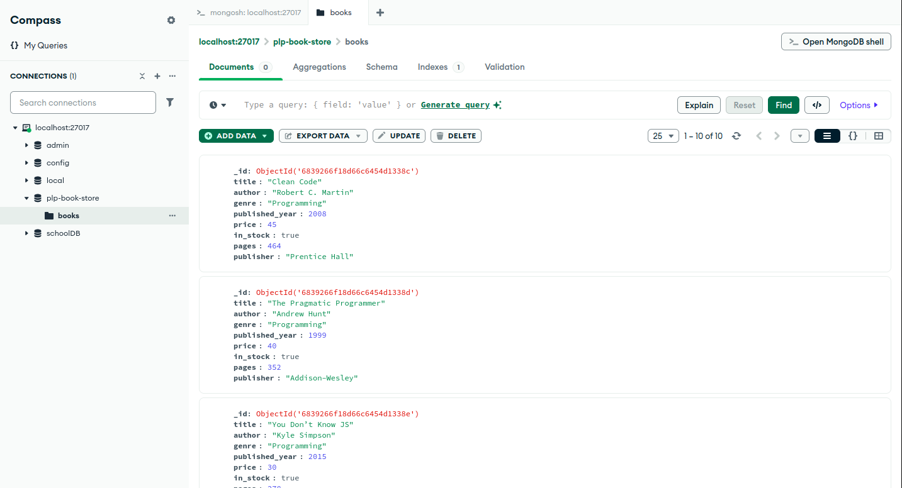

# 📚 PLP Bookstore – MongoDB Project

## 🛠 Setup Instructions

1. Make sure MongoDB is running locally or connect to your MongoDB Atlas or MongoDB compass.
2. Open the MongoDB shell (`mongosh`) and run: load('insert_books.js')
3. run queries using: load(queries.js)

## files
    insert_books.js: Adds 10+ book records
    queries.js: All MongoDB queries for the assignment
    screenshots/: MongoDB Compass screenshot of the books collection

## Project Highlights
    CRUD operations
    Filtering, projection, sorting, and pagination
    Aggregation pipelines
    Index creation and performance analysis
## Screenshot Preview
